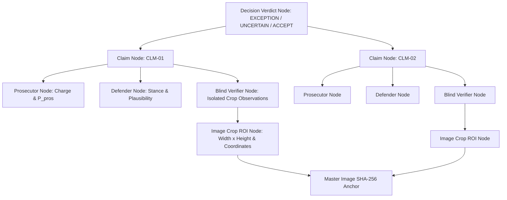

# System Architecture — PRD-3 DEBATE Receiving Manager

## 1. Architectural Philosophy: Evidence-Backed Verification

Conventional AI visual inspection systems rely on single-pass classification, producing confident probabilistic guesses prone to hallucination, lighting bias, and unverified assumptions.

The **PRD-3 DEBATE Architecture** introduces an **Adversarial Multi-Role Multi-Perspective Verification Engine** combined with **Cryptographically Anchored Physical ROI Isolation**:

```text
┌───────────────────────────────────────────────────────────────────────────────┐
│                           PHYSICAL INTAKE / UPLOAD                            │
│           (Purchase Order Metadata + Raw Receiving Photographs)               │
└──────────────────────────────────────┬────────────────────────────────────────┘
                                       │
                                       ▼
┌───────────────────────────────────────────────────────────────────────────────┐
│                     LAYER 1: SECURITY PREPROCESSING PIPELINE                  │
│   • Upload MIME validation & max size bounding (15MB)                         │
│   • Automated EXIF, GPS & IPTC metadata stripping (Sharp)                     │
│   • Cryptographic SHA-256 master hashing                                      │
│   • Untrusted text/OCR sanitization (Prompt injection neutralization)         │
└──────────────────────────────────────┬────────────────────────────────────────┘
                                       │
                                       ▼
┌───────────────────────────────────────────────────────────────────────────────┐
│                     LAYER 2: FEATURE & CLAIM EXTRACTION                       │
│   • PO vs Extracted feature comparison                                        │
│   • Identification (SKU, barcode, serial)                                    │
│   • Physical count vs PO quantity                                             │
│   • Variant specification (color, storage, sub-model)                         │
│   • Packaging integrity (crushed, water damage, torn seal)                    │
│   • Modular kit components check                                              │
│   • Normalized Bounding Box ROI generation [ymin, xmin, ymax, xmax]           │
└──────────────────────────────────────┬────────────────────────────────────────┘
                                       │
                                       ▼
┌───────────────────────────────────────────────────────────────────────────────┐
│                   LAYER 3: 3-ROLE ADVERSARIAL DEBATE PIPELINE                 │
│                                                                               │
│  ┌──────────────────────┐ ┌──────────────────────┐ ┌────────────────────────┐ │
│  │   ROLE 1: PROSECUTOR │ │   ROLE 2: DEFENDER   │ │ ROLE 3: BLIND VERIFIER │ │
│  │   (Defect Advocate)  │ │ (Adversarial Counter)│ │ (Strict Crop Isolation)│ │
│  │                      │ │                      │ │                        │ │
│  │ • Formulates defect  │ │ • Full context scan  │ │ • Cropped ROI ONLY     │ │
│  │   thesis & severity  │ │ • Identifies optical │ │ • ZERO PO context      │ │
│  │ • P_pros score       │ │   glare / reflections│ │ • ZERO claim text      │ │
│  │ • Visual focus ROI   │ │ • P_def plausibility │ │ • Unbiased observation │ │
│  └──────────┬───────────┘ └──────────┬───────────┘ └───────────┬────────────┘ │
└─────────────┼────────────────────────┼─────────────────────────┼──────────────┘
              │                        │                         │
              └────────────────────────┼─────────────────────────┘
                                       │
                                       ▼
┌───────────────────────────────────────────────────────────────────────────────┐
│               LAYER 4: COMPARATOR & DETERMINISTIC CLASSIFICATION              │
│                                                                               │
│   • VERIFIED   ◄── (Blind Verifier confirms anomaly + P_pros > 0.75)          │
│   • CHALLENGED ◄── (Blind Verifier flags glare/low confidence or conflict)    │
│   • REJECTED   ◄── (Defender refutes or Blind Verifier confirms normal)       │
└──────────────────────────────────────┬────────────────────────────────────────┘
                                       │
                                       ▼
┌───────────────────────────────────────────────────────────────────────────────┐
│                     LAYER 5: DECISION SYNTHESIS & AUDIT                       │
│                                                                               │
│   • IF ANY VERIFIED   ──► EXCEPTION (Quarantine & Hold for Vendor Claim)      │
│   • ELSE IF CHALLENGED──► UNCERTAIN (Manual Dock Inspector Review Required)   │
│   • ELSE              ──► ACCEPT    (Approved for Inventory Intake)           │
│                                                                               │
│   • Interactive Evidence Graph generated                                      │
│   • SHA-256 cryptographic chain of custody anchored                           │
│   • Exportable JSON & printable HTML audit dossiers                           │
└───────────────────────────────────────────────────────────────────────────────┘
```

---

## 2. Verification Roles in Detail

### Role 1: Prosecutor
The Prosecutor represents the receiving organization's quality standards. It evaluates incoming PO line items against physical evidence to detect non-compliance:
- Short quantity deficits or unauthorized overages.
- Barcode / SKU mismatches.
- Packaging trauma (corner crushes, damp water tide stains, breached security tape).
- Missing accessories in pre-molded cavities.

### Role 2: Defender
The Defender is an adversarial agent instructed to aggressively seek exculpatory explanations using the full image:
- Camera flash glare vs genuine text mismatches.
- Harmless cardboard folds vs structural puncture damage.
- Ambient lighting color shifts vs actual variant mismatches.
- Multi-layer packaging geometry explanations.

### Role 3: Blind Verifier (Strict Isolation Protocol)
The Blind Verifier operates under strict isolation:
1. **Sub-pixel ROI Extraction**: Sharp extracts only the pixel bounding box `[ymin, xmin, ymax, xmax]` from the clean image buffer.
2. **Cryptographic Crop Hashing**: A unique SHA-256 hash is computed for the crop.
3. **Context-Free Prompt**:
   ```
   [STRICT ISOLATION PROTOCOL]
   Analyze this cropped image patch in complete isolation.
   Do not make assumptions about purchase orders, catalog numbers, or previous inspector claims.
   Objectively describe:
   1. Physical objects and surface textures visible in this image patch.
   2. Any physical anomalies, structural fractures, stains, tears, vacant cavities, or text strings.
   3. Your level of observational confidence (0.0 to 1.0).
   ```
4. **Unbiased Observations**: The model returns raw physical features without anchoring bias.

---

## 3. Evidence Graph Data Model

The Evidence Graph forms an immutable, tamper-evident audit tree:



---

## 4. Security & Safety Architecture

1. **Upload Validation**: Enforces MIME whitelist (`image/jpeg`, `image/png`, `image/webp`, `image/tiff`) and 15MB file size limit.
2. **Metadata Sanitization**: All EXIF tags (including GPS coordinates, camera serials, timestamps) are stripped via Sharp buffer re-encoding before data persistence.
3. **Cryptographic Checksums**: Raw uploaded bytes, sanitized image buffers, and individual visual crops each carry verifiable SHA-256 signatures.
4. **Prompt Injection Defense**: Text extracted from physical labels is treated as untrusted input and sanitized against markdown escapes, HTML injections, and template delimiters before inclusion in model prompts.
5. **Fail-Safe Timeouts**: Verification calls are bounded by 25-second execution timers to prevent dock line blocking.
