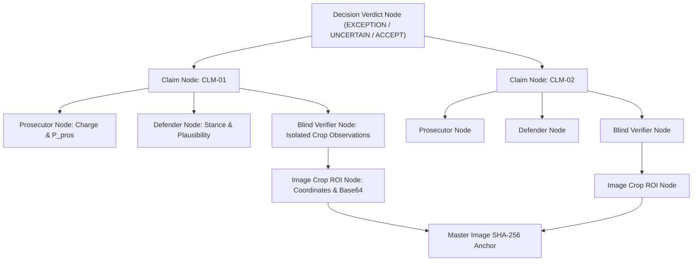

# Architecture & Design Document: PRD-3 DEBATE Receiving Manager (01 · Receiving)

**Project:** CUBE Buildathon 2026 — Commerce Context Stream  
**Stage:** Step 01 of 05 (Inbound Dock & Condition on Arrival)  
**Author:** Harish Bugatha  
**Repository Fork:** `cube26-rcv-0173-harishbugatha`  
**Specification:** PRD-3 DEBATE — Adversarial Multi-Role Verification with Strict Physical Crop Isolation  

---

## 1. Architectural Philosophy: Evidence-Backed Verification

Conventional AI physical inspection systems rely on single-pass classification, producing probabilistic guesses prone to hallucination, ambient lighting bias, and unverified assumptions.

The **PRD-3 DEBATE Architecture** introduces an **Adversarial Multi-Role Multi-Perspective Verification Engine** combined with **Cryptographically Anchored Physical ROI Isolation**:

```text
┌───────────────────────────────────────────────────────────────────────────────┐
│                           PHYSICAL INTAKE / UPLOAD                            │
│           (Purchase Order Metadata + Raw Receiving Photographs)               │
└──────────────────────────────────────┬────────────────────────────────────────┘
                                       │
                                       ▼
┌───────────────────────────────────────────────────────────────────────────────┐
│                     LAYER 1: SECURITY PREPROCESSING PIPELINE                  │
│   • Upload MIME whitelist validation (JPEG, PNG, WEBP, TIFF)                  │
│   • File size bounded at 15MB max                                             │
│   • Automated EXIF, GPS & IPTC metadata stripping (Sharp)                     │
│   • Cryptographic SHA-256 master hashing (Raw & Clean Buffers)                │
│   • Untrusted text/OCR sanitization (Prompt injection neutralization)         │
└──────────────────────────────────────┬────────────────────────────────────────┘
                                       │
                                       ▼
┌───────────────────────────────────────────────────────────────────────────────┐
│                     LAYER 2: FEATURE & CLAIM EXTRACTION                       │
│   • PO line item vs Extracted physical feature comparison                     │
│   • Identity verification (SKU, barcode, serial numbers)                      │
│   • Physical count verification vs PO quantity (Shortage / Overage)           │
│   • Product variant specification check (Color, storage, revision)            │
│   • Packaging integrity verification (Crushed corners, water stains, tears)   │
│   • Modular kit completeness verification (Missing accessories in cavities)   │
│   • Normalized Bounding Box ROI generation [ymin, xmin, ymax, xmax]           │
└──────────────────────────────────────┬────────────────────────────────────────┘
                                       │
                                       ▼
┌───────────────────────────────────────────────────────────────────────────────┐
│                   LAYER 3: 3-ROLE ADVERSARIAL DEBATE PIPELINE                 │
│                                                                               │
│  ┌──────────────────────┐ ┌──────────────────────┐ ┌────────────────────────┐ │
│  │   ROLE 1: PROSECUTOR │ │   ROLE 2: DEFENDER   │ │ ROLE 3: BLIND VERIFIER │ │
│  │   (Defect Advocate)  │ │ (Adversarial Counter)│ │ (Strict Crop Isolation)│ │
│  │                      │ │                      │ │                        │ │
│  │ • Formulates defect  │ │ • Full context scan  │ │ • Cropped ROI ONLY     │ │
│  │   thesis & severity  │ │ • Identifies optical │ │ • ZERO PO context      │ │
│  │ • P_pros score       │ │   glare/reflections  │ │ • ZERO claim text      │ │
│  │ • Evidence focus ROI │ │ • P_def plausibility │ │ • Unbiased observation │ │
│  └──────────┬───────────┘ └──────────┬───────────┘ └───────────┬────────────┘ │
└─────────────┼────────────────────────┼─────────────────────────┼──────────────┘
              │                        │                         │
              └────────────────────────┼─────────────────────────┘
                                       │
                                       ▼
┌───────────────────────────────────────────────────────────────────────────────┐
│               LAYER 4: COMPARATOR & DETERMINISTIC CLASSIFICATION              │
│                                                                               │
│   • VERIFIED   ◄── (Blind Verifier confirms anomaly + P_pros >= 0.75)         │
│   • CHALLENGED ◄── (Blind Verifier flags glare/low confidence or conflict)    │
│   • REJECTED   ◄── (Defender refutes or Blind Verifier confirms normal)       │
└──────────────────────────────────────┬────────────────────────────────────────┘
                                       │
                                       ▼
┌───────────────────────────────────────────────────────────────────────────────┐
│                     LAYER 5: DECISION SYNTHESIS & AUDIT                       │
│                                                                               │
│   • IF ANY VERIFIED   ──► EXCEPTION (Quarantine & Hold for Vendor Claim)      │
│   • ELSE IF CHALLENGED──► UNCERTAIN (Manual Dock Inspector Review Required)   │
│   • ELSE              ──► ACCEPT    (Approved for Inventory Intake)           │
│                                                                               │
│   • Interactive Evidence Graph generated                                      │
│   • SHA-256 cryptographic chain of custody anchored                           │
│   • Exportable JSON & printable HTML audit dossiers                           │
│   • Cross-Pod Contract emitted (Feeds 02 Prep and 05 Recovery)                │
└───────────────────────────────────────────────────────────────────────────────┘
```

---

## 2. Verification Roles & Blind Isolation Protocol

### Role 1: Prosecutor (Defect Advocate)
The Prosecutor represents the receiving facility's quality assurance mandate. It evaluates incoming PO line items against physical evidence to identify non-compliance:
- Short quantity deficits or unauthorized overages.
- Barcode / SKU mismatches.
- Packaging trauma (corner crushes, damp water tide stains, breached security tape).
- Missing accessories in pre-molded cavities.
- Generates a quantified defect confidence score $P_{\text{pros}} \in [0.0, 1.0]$.

### Role 2: Defender (Adversarial Counter-Analysis)
The Defender is an adversarial agent instructed to aggressively seek exculpatory explanations using the full image context:
- Identifies optical camera flash glare versus genuine text mismatches.
- Differentiates harmless cardboard folds from structural puncture damage.
- Calibrates ambient lighting color shifts versus actual variant mismatches.
- Evaluates multi-layer packaging geometry explanations.
- Assigns a defense plausibility score $P_{\text{def}} \in [0.0, 1.0]$.

### Role 3: Blind Verifier (Strict Isolation Protocol)
The Blind Verifier operates under strict isolation:
1. **Sub-pixel ROI Extraction**: Sharp extracts only the pixel bounding box `[ymin, xmin, ymax, xmax]` from the sanitized image buffer.
2. **Cryptographic Crop Hashing**: A unique SHA-256 hash is computed for the crop.
3. **Context-Free Prompt**:
   ```text
   [STRICT ISOLATION PROTOCOL]
   Analyze this cropped image patch in complete isolation.
   Do not make assumptions about purchase orders, catalog numbers, or previous inspector claims.
   Objectively describe:
   1. Physical objects and surface textures visible in this image patch.
   2. Any physical anomalies, structural fractures, stains, tears, vacant cavities, or text strings.
   3. Your level of observational confidence (0.0 to 1.0).
   ```
4. **Context Leakage Prevention**: The Blind Verifier is never provided PO numbers, expected quantities, claim texts, or prior model outputs.

---

## 3. Objective Comparator & Deterministic Classification Rules

| Classification | Condition | Pipeline Disposition |
|---|---|---|
| **`VERIFIED`** | Blind Verifier independently confirms physical anomaly + $P_{\text{pros}} \ge 0.75$ | Supports `EXCEPTION` |
| **`CHALLENGED`** | Blind Verifier confidence $< 0.70$, specular glare detected, or Defender raises valid artifact challenge | Triggers `UNCERTAIN` |
| **`REJECTED`** | Defender disproves defect or Blind Verifier confirms nominal pristine condition | Claim discarded |

### Final Decision Logic:
$$\text{Verdict} = \begin{cases} 
\mathbf{EXCEPTION} & \text{if } \exists c \in \text{Claims} : c.\text{status} = \text{VERIFIED} \land c.\text{type} \neq \text{NOMINAL} \\ 
\mathbf{UNCERTAIN} & \text{else if } \exists c \in \text{Claims} : c.\text{status} = \text{CHALLENGED} \\ 
\mathbf{ACCEPT} & \text{otherwise} 
\end{cases}$$

---

## 4. Evidence Graph Data Model

The Evidence Graph forms an immutable, tamper-evident audit tree:



---

## 5. Security & Safety Architecture

1. **Upload Validation**: Enforces strict MIME whitelist (`image/jpeg`, `image/png`, `image/webp`, `image/tiff`) and 15MB file size limit.
2. **Metadata Sanitization**: All EXIF tags (including GPS coordinates, camera serials, timestamps) are stripped via Sharp buffer re-encoding before data persistence.
3. **Cryptographic Checksums**: Raw uploaded bytes, sanitized image buffers, and individual visual crops each carry verifiable SHA-256 signatures.
4. **Prompt Injection Defense**: Text extracted from physical labels is treated as untrusted input and sanitized against markdown escapes, HTML injections, and template delimiters before inclusion in model prompts.
5. **Fail-Safe Timeouts**: Verification calls are bounded by 25-second execution timers to prevent dock line blocking.

---

## 6. Buildathon Compliance & Multi-Tenancy

### Rule 1: Tenancy Isolation
- Strict Row-Level Security for `org_demo_alpha` and `org_demo_bravo`. Zero cross-tenant leakage.

### Rule 2: Cross-Pod Evidence Contract
- Completed receiving records output standard JSON payloads binding physical evidence, claims, crop hashes, and verdicts to `unit_id`, feeding Step 02 Prep and Step 05 Recovery.

### Rule 3: Operator Overrides Are Preserved as Data
- When a dock supervisor overrides an automated decision, the original verdict, override verdict, operator ID, timestamp, and mandatory justification are stored in the tamper-evident audit log.
